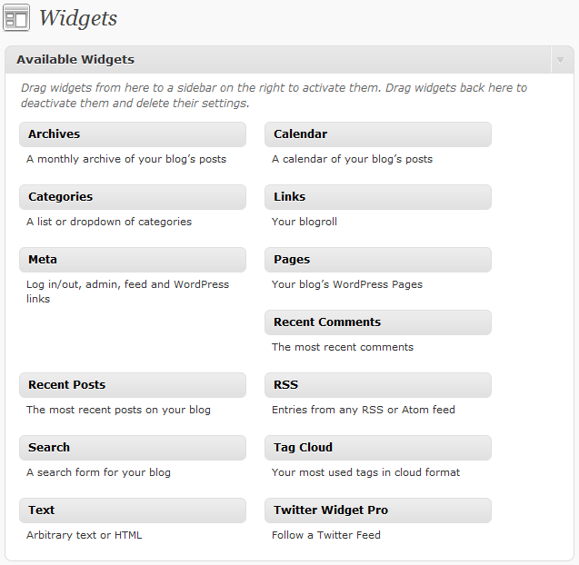
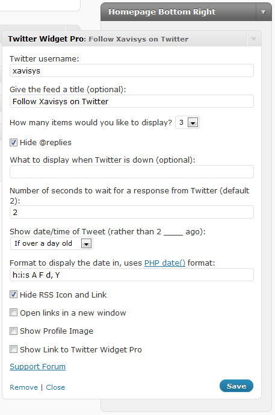
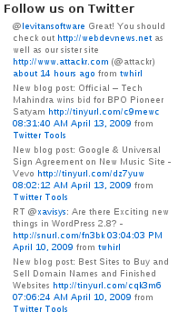
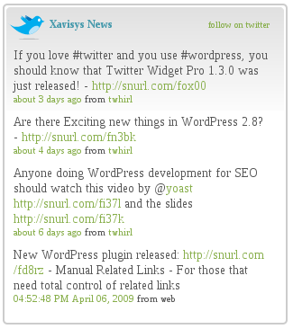

=== Twitter Widget ===

Contributors: fossasia
Tags: loklak, feed, tweet feed, loklak API, twitter, widget, feed
Requires at least: 3.0
Tested up to: 4.3
Stable tag: 1.0

A widget that properly handles twitter feeds, including parsing @username, #hashtags, and URLs into links.

== Description ==

A widget that properly handles twitter feeds, including parsing @username, #hashtag, and URLs into links.  It supports displaying profiles images, and even lets you control whether to display the time and date of a tweet or how log ago it happened (about 5 hours ago, etc).


== Installation ==

1. Use automatic installer to install and active the plugin.
1. You should see a notice appear in your admin that links you to the settings page.
1. Follow the instructions to setup your Twitter app and authenticate your account (an unfortunate step made necessary by Twitter's API changes).
1. In WordPress admin go to 'Appearance' -> 'Widgets' and add "Twitter Widget" to one of your widget-ready areas of your site

== Frequently Asked Questions ==

= Can I follow more than one feed? =

Absolutely, each instance of the widget can have different settings and track different feeds.

= I get an error similar to "Parse error: syntax error, unexpected T_STRING, expecting T_OLD_FUNCTION or T_FUNCTION or T_VAR or '}' in /.../wp-twitter-widget.php on line ##" when I try to activate the plugin.  Is your plugin broke? =

No.  This error occurs because the plugin requires PHP 5 and you're running PHP 4. Most hosts offer PHP5 but sometimes you have to enable it in your control panel, through .htaccess, or by asking them.  There may be instructions for your specific host in the <a href="http://codex.wordpress.org/Switching_to_PHP5">Switching to PHP5</a> article in the codex.

= How can I add this widget to a post or page? =

You can now use the twitter-widget shortcode to embed this widget into a post or
page.  The simplest form of this would be `[twitter-widget username="yourTwitterUsername"]`

= How exactly do you use the twitter-widget shortcode? =

The simplest form of this would be `[twitter-widget username="yourTwitterUsername"]`
However, there are more things you can control.

* username - A Twitter username to pull a feed of Tweets from.  The user needs to be authenticated.
* list - A Twitter list id owned by one of the users you've authenticated.
* before_widget - This is inserted before the widget.
* after_widget - This is inserted after the widget, and is often used to close tags opened in before_widget
* before_title - This is inserted before the title and defults to <h2>
* after_title - This is inserted after the title and defults to </h2>
* errmsg - This is the error message that displays if there's a problem connecting to Twitter
* hiderss - set to true to hide the RSS icon (defaults to false)
* hidereplies - set to true to hide @replies that are sent from the account (defaults to false)
* hidefrom - set to true to hide the "from ____" link that shows the application the tweet was sent from (defaults to false)
* avatar - set to one of the available sizes (mini, normal, bigger, or original) (defaults to none)
* targetBlank - set to true to have all links open in a new window (defaults to false)
* showXavisysLink - set to true to display a link to the Twitter Widget page.  We greatly appreciate your support in linking to this page so others can find this useful plugin too!  (defaults to false)
* items - The number of items to display (defaults to 10)
* fetchTimeOut - The number of seconds to wait for a response from Twitter (defaults to 2)
* showts - Number of seconds old a tweet has to be to show ___ ago rather than a date/time (defaults to 86400 seconds which is 24 hours)
* dateFormat - The format for dates (defaults to'h:i:s A F d, Y' or it's localization)
* title - The title of the widget (defaults to 'Twitter: Username')
* showretweets - set to true to show retweets, false to hide them (defaults to true)
* showintents - set to true to show the reply, retweet, and favorite links for each tweet, false to hide them (defaults to true)
* showfollow - set to true to show the follow button after tweets, false to hide it (defaults to true)

You can see these put into action by trying something like:

* `[twitter-widget username="wpinformer" before_widget="<div class='half-box'>" after_widget="</div>" before_title="<h1>" after_title="</h1>" errmsg="Uh oh!" hiderss="true" hidereplies="true" targetBlank="true" avatar="1" showXavisysLink="1" items="3" showts="60"]Your Title[/twitter-widget]`
* `[twitter-widget username="wpinformer" before_widget="<div class='half-box'>" after_widget="</div>" before_title="<h1>" after_title="</h1>" errmsg="Uh oh!" hiderss="true" hidereplies="true" targetBlank="true" avatar="1" showXavisysLink="1" items="3" showts="60" title="Your Title"]`
* `[twitter-widget username="wpinformer"]`

= How can I style it to look nicer? =

There are plenty of CSS classes throughout the HTML that is generated, and you can use those to style things.  Here is some sample CSS that I use with the <a href="http://essencetheme.com" title="Essence Theme for WordPress">Essence Theme</a>.  You'll need to get the "Everything" sprite from <a href="https://dev.twitter.com/docs/image-resources">Twitter's Image Resources</a>.

```
.widget_twitter div {
	padding:0;
}

.widget_twitter ul li {
	margin-bottom:5px;
}

.widget_twitter .follow-button,
.widget_twitter .xavisys-link {
	margin:0 10px 10px 25px;
}

.widget_twitter .entry-meta {
	display:block;
	font-size:80%;
}

.widget_twitter .intent-meta a {
	background: url(images/everything-spritev2.png); /** from Twitter ressources */
	display: inline-block;
	height: 16px;
	text-indent: -9999px;
	width: 16px;
}
.widget_twitter .intent-meta a.in-reply-to {
	background-position: 0 center;
}
.widget_twitter .intent-meta a:hover.in-reply-to {
	background-position: -16px center;
}
.widget_twitter .intent-meta a.favorite {
	background-position: -32px center;
}
.widget_twitter .intent-meta a:hover.favorite {
	background-position: -48px center;
}
.widget_twitter .intent-meta a.retweet {
	background-position: -80px center;
}
.widget_twitter .intent-meta a:hover.retweet {
	background-position: -96px center;
}
```

= Why can't I display a friends feed anymore? =

Aparently the database queries required to display the friends feed was causing twitter to crash, so they removed it.  Unfortunately, this is outside my control.

== Screenshots ==

1. To use the widget, go to Appearance -> Widgets and Add "Twitter Widget" widget.

	

2. Each widget has settings that need to be set, so the next step is to click the down arrow on the right of the newly added widget and adjust all the settings.  When you're done click "Save"

	

3. This is what the widget looks like in the default theme with no added styles.

	

4. By using some (X)HTML in the title element and adding a few styles and a background image, you could make it look like this.

	

== Upgrade Notice ==

= 1.0 =
A whole new version!
